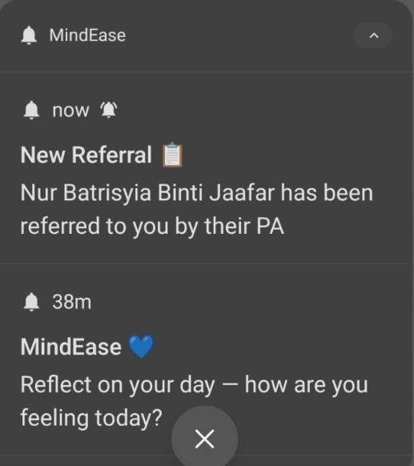
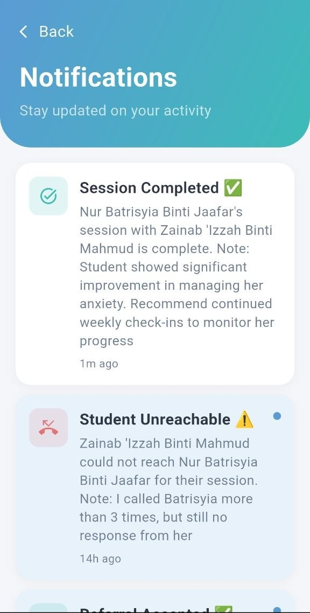

# MindEase 🧠

A Flutter + Firebase mobile system for monitoring and supporting student emotional wellbeing, built as a Final Year Project.

## 📱 Overview

MindEase helps identify students at risk of emotional distress through structured self-reporting and threshold-based risk classification, connecting them with personal advisors and counsellors for timely support.

## ✨ Key Features

- **Multi-role dashboards** — separate interfaces for Student, Personal Advisor, Counsellor and Admin with role-based access control
- **Daily mood logging** — students log their emotional state daily using a 5-level emoji scale
- **DASS-21 stress self-assessment** — standardised psychometric tool measuring depression, anxiety and stress severity
- **Descriptive analytics** — weekly mood aggregation and threshold-based risk classification into Normal, Moderate or Critical
- **PA monitoring dashboard** — real-time student monitoring with colour-coded threshold badges for early identification
- **PA-to-Counsellor referral workflow** — structured in-app referral system for at-risk students
- **Counsellor session management** — schedule sessions, send reminders, write progress reports and mark sessions as done
- **Relaxation Corner** — motivational quotes, self-care tips and calming exercises based on risk level
- **Push notifications** — automated mood reminders via OneSignal and Railway.app scheduled server
- **Admin controls** — manage users, import student data, manage relaxation content and toggle Break Mode
- **Secure authentication** — Firebase Authentication with password complexity enforcement and forgot password via email

## 🛠️ Tech Stack

| Layer          | Technology                     |
|----------------|---------------------------------|
| Frontend       | Flutter (Dart)                  |
| Backend        | Firebase (Firestore, Auth, Functions) |
| Notifications  | OneSignal                       |
| Testing        | Flutter unit testing (28+ tests)|

## 📸 Screenshots

<h4>Login</h4>


<h4>Student Dashboard</h4>


<h4>Logging Mood</h4>


<h4>DASS-21 Assessment</h4>


<h4>Mood Tracking</h4>


<h4>Mood Tracking (Continuous)</h4>


<h4>Personal Advisor Dashboard</h4>


<h4>Counsellor Dashboard</h4>


<h4>Push-Notification</h4>


<h4>In-app Notification</h4>


<h4>Admin Dashboard</h4>


## 🚀 Getting Started

```bash
git clone https://github.com/InsyirahIshak/mindease_app.git
cd mindease_app
flutter pub get
flutter run
```

> **Note:** Firebase and OneSignal configuration files (`google-services.json`, `.env`) are excluded for security. You'll need your own Firebase project and OneSignal app set up to run this locally.

## 🧪 Testing

```bash
flutter test
```

## 📄 Project Context

Developed as a Final Year Project (FYP) exploring how mobile technology can support early identification and intervention for student emotional wellbeing.

## 👩‍💻 Author

**Insyirah Ishak**