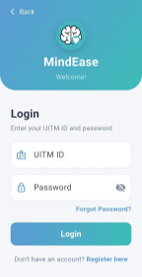
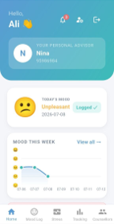
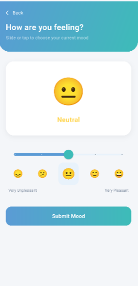
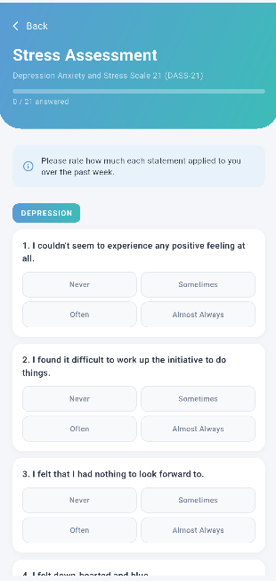
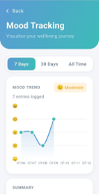
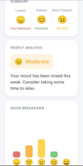
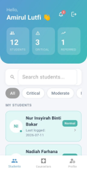
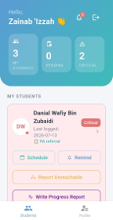
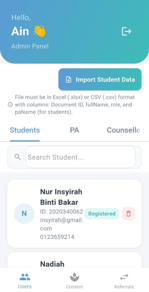

# MindEase 🧠

A Flutter + Firebase mobile system for monitoring and supporting student emotional wellbeing, built as a Final Year Project.

## 📱 Overview

MindEase helps identify students at risk of emotional distress through structured self-reporting and threshold-based risk classification, connecting them with personal advisors and counsellors for timely support.

## ✨ Key Features

- **Multi-role dashboards** — separate interfaces for Student, Personal Advisor, Counsellor, and Admin
- **Risk classification system** — threshold-based reclassification to flag students needing attention
- **Real-time notifications** — push alerts via OneSignal for timely follow-ups
- **Secure authentication** — Firebase Auth with App Check and device fingerprint verification
- **Progress tracking** — students can log and submit progress reports
- **Responsive UI** — tested and optimized across multiple Android devices

## 🛠️ Tech Stack

| Layer          | Technology                     |
|----------------|---------------------------------|
| Frontend       | Flutter (Dart)                  |
| Backend        | Firebase (Firestore, Auth, Functions) |
| Notifications  | OneSignal                       |
| Testing        | Flutter unit testing (28+ tests)|

## 📸 Screenshots

| Login | Student Dashboard | Logging Mood | DASS-21 Assessment | Mood Tracking | Mood Tracking (Continuous) | PA Dashboard  | Counsellor Dashboard | Admin Dashboard |
|-------|-------------------|------------------|------------------|------------------|------------------|------------------|------------------|------------------|
|  |  |  |  |  |  |  | | |

## 🚀 Getting Started

```bash
git clone https://github.com/InsyirahIshak/mindease_app.git
cd mindease_app
flutter pub get
flutter run
```

> **Note:** Firebase and OneSignal configuration files (`google-services.json`, `.env`) are excluded for security. You'll need your own Firebase project and OneSignal app set up to run this locally.

## 🧪 Testing

```bash
flutter test
```

## 📄 Project Context

Developed as a Final Year Project (FYP) exploring how mobile technology can support early identification and intervention for student emotional wellbeing.

## 👩‍💻 Author

**Insyirah Ishak**